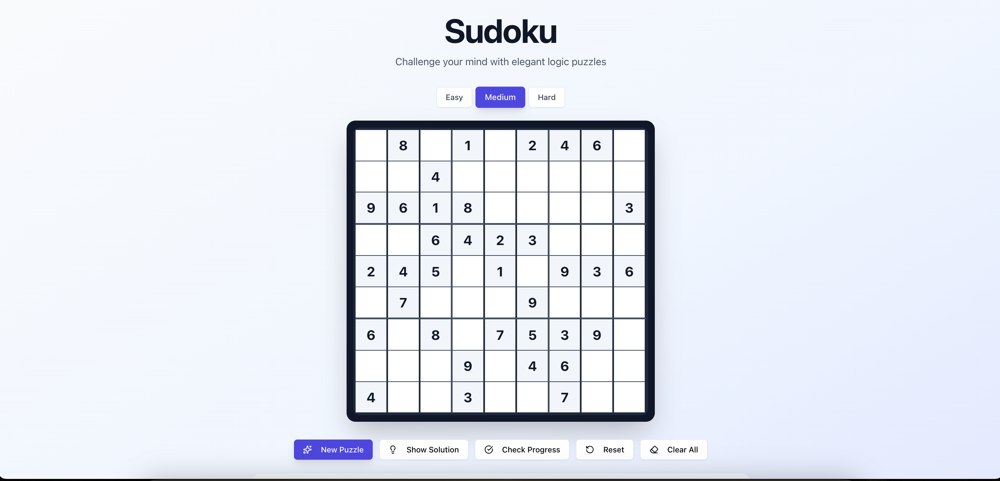
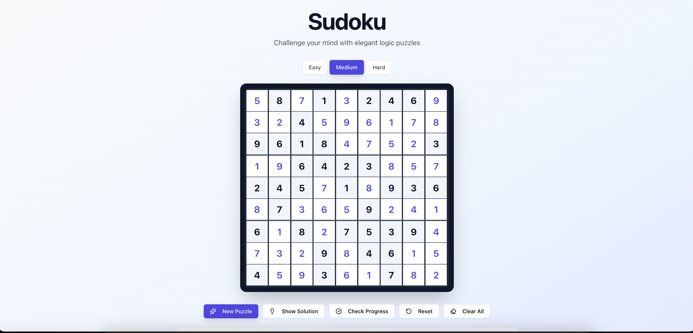

# 🧩 Sudoku Generator

A Sudoku game built with Base44!  
Solve puzzles in Easy, Medium, and Hard modes, check your progress, or reveal the full solution anytime.
Your progress is automatically saved using LocalStorage, so you can continue right where you left off.

[Github Pages Link](https://alfinaim.github.io/Sudoku-Generator/)
  

## 🎮 Gameplay Overview

* Three difficulty levels – Easy, Medium, Hard
* Real-time progress checks – See if your moves are correct
* Smart solution engine – Show full solution for any puzzle
* LocalStorage support – Keeps your puzzle progress even after refresh
  

## 🛠️ Tech Stack

* React 
* TailwindCSS 
* Local storage
  

## 🚀 Future Plans

* Timer & high-scores table
* More board sizes (4×4, 16×16 Sudoku)
* Themes (dark/light/system)
  

## Screenshots

#### Home

#### Solved

  

## 💻 Installation

    git clone https://github.com/alfinaim/Sudoku-Generator.git
    cd Sudoku-Generator
    npm install
    npm start
